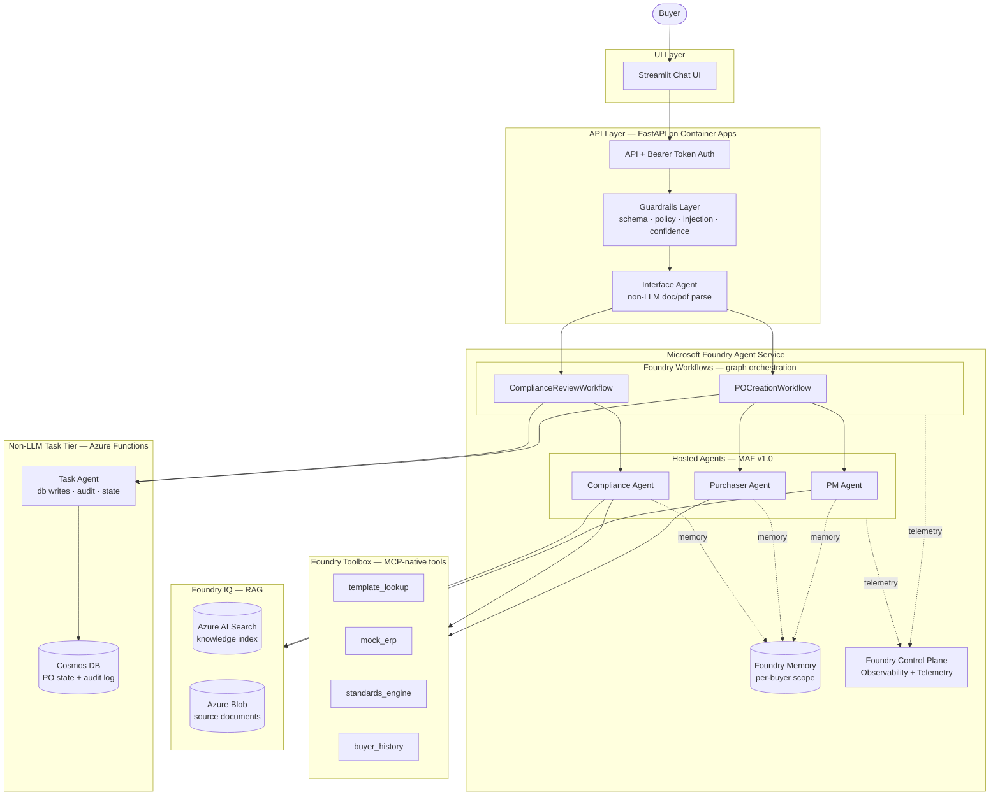
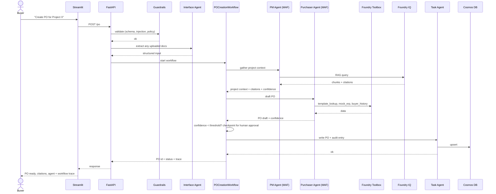

# Procurement Agentic Demo — Project Document

**Version:** v3.2 (Frozen — adds lifecycle & cost discipline)
**Last Updated:** 2026-05-02
**Status:** Frozen — changes require a change-request turn
**Companion:** [`BACKLOG.md`](./BACKLOG.md) — the live status tracker

---

## How to Read This Document

This is one of **two** documents that fully describe the project:

1. **`PROJECT.md`** (this document) — what we're building, how we work. Slow-changing.
2. **`BACKLOG.md`** — the prioritized list of work and the live status tracker. Updated every story.

If both files are at the same version-major, you have full context. No other documents are required.

### For Claude picking up the project mid-stream

If you are reading this in a fresh conversation, the user has shared this document and `BACKLOG.md` to give you full context. Here is your role:

- **You are the Architect.** The user is the Project Owner. Implementation is done by Claude Code (a separate tool the user operates).
- **Do this on every interaction:**
  1. Read this document and `BACKLOG.md` end-to-end before responding.
  2. Confirm the current Status Snapshot from `BACKLOG.md` (top of that file).
  3. Identify what story is in flight (or what the user is asking about).
- **Your responsibilities:**
  - When asked for a story spec, re-cast the relevant `BACKLOG.md` story into a Claude-Code-ready spec — imperative tone, explicit file paths, library versions, constraints.
  - When the user brings back completed work, review against acceptance criteria. Issue one of three verdicts: 🟢 Closed, 🟡 Gaps (with numbered list), 🔴 Blocked (with unblock path).
  - Update the Status Snapshot in `BACKLOG.md` after every closure.
  - Flag risks unprompted: scope creep, drift from frozen architecture, cost trajectory, demo-blocker patterns.
  - Treat changes to this document as a formal change request. Do impact analysis, version-bump, log the change.
- **Do not** modify code, infra, or anything outside `docs/`. That is Claude Code's domain.

---

# Part I — Project

## I.1 Purpose

A public, portfolio-grade demonstration of an enterprise agentic procurement workflow on **Microsoft Azure AI Foundry**. The system showcases the patterns a Generative AI Architect uses in production: multi-agent orchestration via Microsoft Agent Framework + Foundry Workflows, retrieval-augmented generation grounded in Foundry IQ, an MCP-native tool layer via Foundry Toolbox, guardrails, observability via Foundry Control Plane, and Azure-native deployment with IaC and CI/CD.

The repository is **original, generic, and contains no proprietary IP** from any employer or client.

## I.2 Goals

1. End-to-end working demo deployable to Azure with a single command (`azd up` or `make deploy`).
2. Architecturally faithful to Microsoft's GA agentic stack as of 2026: **Microsoft Agent Framework v1.0** (April 3, 2026 GA) running on **Foundry Agent Service** (April 22, 2026 hosted-agents preview pricing).
3. Demo-ready in 4 weeks of evening/weekend work.
4. Reviewable: clean repo layout, ADRs, demo script, recorded walkthrough.

## I.3 Non-Goals

- Replicating any specific employer system, schema, or product naming.
- **Referencing any employer or client by name** — anywhere in code, comments, commit messages, ADRs, READMEs, demo scripts, or recordings. The repository must read as fully original work. The architect (Claude in any conversation) and any implementer must not introduce employer-specific names; if a fresh Claude conversation is given context that mentions an employer, that context is for grounding only and does not get reproduced in artifacts.
- Production-hardened security (no hub-spoke, no DDoS, no Defender for Cloud, no zone-redundant multi-AZ — these are **documented as production posture**, not implemented).
- Multi-region active-active.
- **Multi-environment promotion (no dev/staging/prod separation)** — the project runs a **single Azure environment** that is the live demo. `main` branch is production; every merge deploys.
- Real ERP integration — **mocked** behind a Foundry MCP tool.
- Full OAuth/RBAC — **single bearer token** at the API edge for the demo (Foundry-internal identity uses Microsoft Entra Agent Identity).
- A production-grade UI — Streamlit is sufficient.

## I.4 Domain

A synthetic procurement scenario:

- A **Buyer** initiates a purchase order request tied to a project.
- The **PM Agent** (LLM, MAF) gathers project context — scope, budget, vendor preferences — using RAG over a synthetic project knowledge base via Foundry IQ.
- The **Purchaser Agent** (LLM, MAF) drafts the PO, runs cost and policy checks via Foundry Toolbox tools, and asks the user clarifying questions when confidence is low.
- The **Compliance Agent** (LLM, MAF) validates the draft against a synthetic standards corpus before submission.
- An **Interface Agent** (non-LLM, plain Python in API) handles deterministic doc/PDF extraction.
- A **Task Agent** (non-LLM, plain Python invoked from a Workflow node) handles deterministic DB writes, state changes, and audit log writes.

Two Foundry Workflows coordinate the flow:

- `POCreationWorkflow` — Buyer → PM Agent → Purchaser Agent → human-in-the-loop approval (Workflow checkpoint) → submission via Task Agent
- `ComplianceReviewWorkflow` — submitted PO → Compliance Agent → standards check → approve/reject → audit via Task Agent

---

# Part II — Architecture (Frozen)

## II.1 High-Level Architecture



## II.2 Components

### II.2.1 UI — Streamlit
Single chat interface with a Buyer persona. Shows agent traces (which agent acted, tool calls, citations, MAF execution graph) in an expandable panel for demo transparency. Pulls trace data from Foundry Observability via the API.

### II.2.2 API — FastAPI on Azure Container Apps
Thin REST surface: `/po`, `/po/{id}/status`, `/po/{id}/audit`, `/health`. Bearer-token auth, request validation via Pydantic, calls into Foundry Workflows via the Foundry SDK. Hosts the Interface Agent (deterministic Python — no LLM).

### II.2.3 Guardrails Layer
Applied **at the API boundary and at every agent→tool call**. Five checks:
- **Schema enforcement** — Pydantic models for every input/output (API edge); MAF type-safe agent contracts (inside Foundry).
- **Prompt injection** — Foundry built-in XPIA (cross-prompt injection attack) guardrails on hosted agents + heuristic + LLM-as-judge classifier on user input at the API edge.
- **Policy validator** — domain rules (e.g., PO amount > threshold requires Compliance Workflow path).
- **Confidence thresholding** — agent must return a self-reported confidence; below threshold triggers human-in-the-loop via Workflow checkpoint.
- **Foundry safety filters** — content moderation built into hosted agents.

### II.2.4 Orchestration — Microsoft Foundry Workflows
**Foundry Workflows** is the primary orchestrator. Graph-based orchestration with executors and edges, conditional routing, parallel execution, checkpointing for human-in-the-loop, and multi-agent patterns (sequential, hand-off). Workflows author-time: visual builder in VS Code Foundry Extension or Azure AI Foundry portal. Runtime: managed by Foundry Agent Service.

**Azure Durable Functions** is retained for **non-LLM long-running batch operations** only — specifically the Task Agent's audit-log batching when sustained throughput exceeds Foundry Workflow's per-execution scope. For the demo's volume, single-call Task Agent invocations from Workflow nodes suffice; Durable Functions are deferred unless we need them.

### II.2.5 Agents — Microsoft Agent Framework v1.0 (Python)

**Microsoft Agent Framework (MAF)** is the SDK and runtime for all LLM agents. MAF reached 1.0 GA on April 3, 2026, unifying Semantic Kernel and AutoGen.

- **LLM agents** (PM, Purchaser, Compliance): MAF `Agent` instances using `FoundryChatClient` to access Foundry-deployed models. Each has role-specific instructions, tool access via Toolbox, memory access via Foundry Memory.
- **Non-LLM agents** (Interface, Task): plain Python — deterministic, no LLM call, no temperature.
- **Agent → Workflow integration:** agents are nodes inside Foundry Workflows. The Workflow handles routing, checkpointing, and state.

**Authentication:** `DefaultAzureCredential` for local dev; `ManagedIdentityCredential` from Container Apps in production.

### II.2.6 MCP-Native Tool Layer — Foundry Toolbox

**Foundry Toolbox** provides a single MCP-compatible endpoint that any MAF agent (or LangGraph agent, or external client) can consume. Tool authoring is centralized; Foundry handles auth (Microsoft Entra Agent Identity, OAuth identity passthrough), tracing, and observability for every tool call.

Implementations:
- `template_lookup` — returns PO templates by category
- `mock_erp` — simulates ERP queries (vendor lookup, budget check)
- `standards_engine` — returns applicable compliance standards
- `buyer_history` — returns a buyer's past orders

All four are **read-only HTTP services**, registered with Foundry Toolbox, exposed through the unified MCP endpoint. Built using a small FastAPI sidecar running in Container Apps.

### II.2.7 Memory — Foundry Memory + Cosmos DB

**Foundry Memory** (preview, billed from June 1, 2026) provides per-agent persistent memory with native MAF integration. Used for: short-term conversation context, long-term per-buyer preferences (custom `userId` header for non-Entra scoping).

**Cosmos DB (NoSQL)** stores **PO state and audit log** — these are domain records, not agent memory. Owned by the Task Agent.

### II.2.8 RAG — Foundry IQ

**Foundry IQ** is the agentic RAG engine, powered by Azure AI Search with built-in user access permissions. Single entry point connects to multiple knowledge sources.

Synthetic corpus: ~30 documents (project briefs, vendor profiles, compliance standards, PO templates). Ingestion pipeline: chunk → embed (`text-embedding-3-large`) → index via Foundry IQ, which provisions and manages the Azure AI Search index. Hybrid search (keyword + vector) with semantic ranker. Citations returned in agent responses.

### II.2.9 Observability — Foundry Control Plane

**Foundry Control Plane Observability** is the primary observability surface. Out-of-the-box telemetry for:
- Hosted agent execution traces (prompts, completions, tool calls, agent transitions)
- Workflow execution traces (node invocations, checkpoint hits, parallel branches)
- Toolbox tool-call traces (latency, failures, auth events)
- Token counts and per-execution cost

**Application Insights + Log Analytics** receive telemetry from non-Foundry pieces (FastAPI API, Streamlit UI, Task Agent, Container Apps platform metrics). Foundry exports to App Insights for unified dashboards.

### II.2.10 IaC — Bicep
Modular Bicep: `main.bicep` composes modules for `foundry.bicep` (Foundry project + agent service + IQ), `cosmos.bicep`, `storage.bicep` (Blob + Durable state if needed), `containerapps.bicep` (FastAPI + Streamlit + Toolbox tools), `monitoring.bicep`, `acr.bicep` (for hosted-agent container images). Single environment, single `main.bicepparam`. One-command deploy via `azd up`.

### II.2.11 CI/CD — GitHub Actions (Single-Environment Continuous Deployment)

**Deployment model:** one Azure environment, `main` branch is production, every merge deploys.

Three workflows:

- **`ci.yml`** — runs on every PR. Steps: lint (ruff + black) → unit tests → Bicep what-if (read-only, posts diff as PR comment) → integration tests with mocked Foundry/Azure clients. **Blocks merge on failure.**
- **`cd-infra.yml`** — runs on push to `main` when `infra/**` changed. Steps: Bicep what-if (logged) → `az deployment sub create`. Uses GitHub OIDC federation (no long-lived secrets) with a service principal that has `Contributor` on the resource group + `Azure AI Project Manager` on the Foundry project (required for hosted-agent deployments).
- **`cd-app.yml`** — runs on push to `main` when `backend/**` or `frontend/**` changed. Steps: build container → push to ACR → `azd deploy` for hosted agents → update FastAPI/Streamlit Container App revisions → smoke-test `/health` and a representative MAF agent invocation before promoting traffic to 100%.

Path filters mean: an infra-only change does not redeploy the app, and an app-only change does not redeploy infra. A change touching both runs both workflows in parallel against the same environment.

**Rollback:**
- App: `az containerapp revision activate --revision <previous>` for FastAPI/Streamlit; Foundry hosted-agent versioning for agent rollback (~30 sec each).
- Infra: redeploy Bicep with the previous main commit checked out.

**Visibility:** every merge produces an Application Insights deployment annotation, so all changes show up on dashboards as marked release events.

## II.3 Data Flow — PO Creation Happy Path



## II.4 Tech Stack (Frozen)

| Concern | Choice | Rationale |
|---|---|---|
| Frontend | Streamlit | Fastest path to a credible chat UI |
| API | FastAPI | Industry-standard Python async API |
| API Hosting | Azure Container Apps | Serverless containers, scale-to-zero |
| Orchestration | **Microsoft Foundry Workflows** | Native Azure managed graph orchestration; checkpointing; multi-agent patterns |
| Agent SDK | **Microsoft Agent Framework v1.0 (Python)** | GA April 2026; merger of Semantic Kernel + AutoGen; native Foundry integration |
| Agent Hosting | **Foundry Agent Service (hosted agents)** | Managed scaling, identity, observability |
| LLM Access | **FoundryChatClient** → Azure OpenAI | Foundry-managed model deployments |
| LLM | gpt-4o (primary), gpt-4o-mini (cost-sensitive) | Strong capability, current Azure availability |
| Embeddings | text-embedding-3-large | Strong quality, cost-reasonable |
| RAG | **Foundry IQ** (Azure AI Search hybrid) | Native Foundry RAG with permission-aware retrieval |
| Document Store | Azure Blob | Cheap, native, integrated with Foundry IQ |
| Memory | **Foundry Memory** (preview) + Cosmos DB | Foundry Memory for agents; Cosmos for domain state |
| Domain DB | Cosmos DB (NoSQL) | Low-latency PO state + audit log |
| Tools | **Foundry Toolbox** (MCP-native) | Single endpoint, built-in auth, observability |
| Identity (agents) | **Microsoft Entra Agent Identity** | Per-agent identity for downstream service access |
| Identity (infra) | Managed Identity | API/Streamlit/Task Agent → Cosmos, Storage |
| Container Registry | Azure Container Registry | Required for Foundry hosted-agent deployments |
| Secrets | Azure Key Vault | Managed identity from Container Apps |
| Observability | **Foundry Control Plane** + App Insights + Log Analytics | Foundry-native for agents/workflows; App Insights for non-Foundry |
| IaC | Bicep | Azure-native, simpler than Terraform here |
| CI/CD | GitHub Actions | Free for public repos |
| Eval | pytest + ragas + Foundry evaluations | Local + Foundry-managed agent evals |

## II.5 Repository Layout (Frozen)

```
ProcurementDemo/                     # subfolder of GenAISolutions umbrella repo
├── README.md
├── Makefile
├── azure.yaml                       # azd config
├── pyproject.toml
├── .pre-commit-config.yaml
├── .gitignore
├── docs/
│   ├── PROJECT.md                   # this document
│   ├── BACKLOG.md                   # status tracker
│   ├── demo-script.md               # added in M4.5
│   ├── adrs/
│   │   ├── 0001-foundry-and-maf-not-langgraph-standalone.md
│   │   ├── 0002-streamlit-not-react.md
│   │   ├── 0003-bicep-not-terraform.md
│   │   ├── 0004-foundry-memory-vs-cosmos-split.md
│   │   ├── 0005-foundry-iq-for-rag.md
│   │   └── ...
│   └── diagrams/
├── infra/
│   ├── main.bicep
│   ├── main.bicepparam              # single env — production
│   └── modules/
│       ├── foundry.bicep            # Foundry project + Agent Service + IQ
│       ├── cosmos.bicep
│       ├── storage.bicep
│       ├── acr.bicep                # Container Registry for hosted agents
│       ├── containerapps.bicep      # API, Streamlit, Toolbox sidecar
│       └── monitoring.bicep
├── backend/
│   ├── api/                         # FastAPI app
│   ├── agents/                      # MAF agent definitions
│   │   ├── pm_agent.py
│   │   ├── purchaser_agent.py
│   │   ├── compliance_agent.py
│   │   ├── interface_agent.py       # non-LLM, runs in API
│   │   └── task_agent.py            # non-LLM, callable from Workflow nodes
│   ├── workflows/                   # Foundry Workflow definitions
│   │   ├── po_creation.py
│   │   └── compliance_review.py
│   ├── tools/                       # Foundry Toolbox tool implementations
│   ├── rag/                         # Foundry IQ ingestion + query helpers
│   ├── guardrails/                  # API-edge validators
│   └── telemetry/                   # custom telemetry helpers; Foundry exports
├── frontend/
│   └── streamlit_app.py
├── data/
│   ├── project_briefs/              # synthetic
│   ├── vendor_profiles/
│   ├── compliance_standards/
│   └── po_templates/
├── tests/
│   ├── unit/
│   ├── integration/
│   └── evals/
└── .github/workflows/
    ├── ci.yml
    ├── cd-infra.yml
    └── cd-app.yml
```

## II.6 Demo-Complete Acceptance Criteria

The project is **demo-complete** when **all** of the following are true:

1. Single-command provision and deploy to a fresh Azure subscription with no manual steps (`azd up`).
2. A buyer can create a PO end-to-end through the Streamlit UI, with the agent + workflow trace visible.
3. The Compliance Review workflow triggers correctly for POs above the policy threshold.
4. Citations from Foundry IQ are visible in agent responses.
5. A guardrail violation (prompt injection in a test prompt) is blocked by Foundry XPIA filters and logged in Foundry Observability.
6. Foundry Control Plane shows traces for at least one full PO lifecycle.
7. CI passes on `main`; `cd-infra.yml` and `cd-app.yml` deploy successfully on every relevant merge.
8. README has architecture diagram, quickstart, demo script, and 5-minute walkthrough video link.
9. At least 5 ADRs are committed.
10. Eval suite passes: RAG retrieval precision ≥ 0.7 on the test set; end-to-end happy-path test green; Foundry-managed agent eval on at least one agent shows ≥ 0.7 task success.

---

# Part III — Working Agreement

## III.1 Roles

### Project Owner ([Your Name])
- Sets direction, priorities, and demo target.
- Picks which story to work on next.
- Operates Claude Code; pastes story specs in.
- Brings the output back to the architect for review.
- Has final authority on scope changes.
- **Gatekeeper at merge:** because `main` is live, the owner is the last reviewer before deploy.

### Architect (Claude — this assistant)
- Owns `PROJECT.md` and `BACKLOG.md`.
- Writes story specs and acceptance criteria.
- Reviews completed work against AC.
- Closes stories or returns them with a gap list.
- Maintains the Status Snapshot in `BACKLOG.md`.
- Flags risk early — scope creep, tech debt, missed dependencies.

### Implementer (Claude Code)
- Writes code, tests, infrastructure, docs per story spec.
- Asks clarifying questions when AC is ambiguous (route through the project owner back to the architect).
- Does **not** modify `PROJECT.md` or `BACKLOG.md` — those are architect-owned.

## III.2 Workflow

### Picking a story
1. Project owner reviews the Status Snapshot in `BACKLOG.md`.
2. Picks the next 🔵 story whose dependencies are all 🟢.
3. Confirms the pick with the architect (one-line check-in).
4. Architect updates the story to 🟡 and the "Currently in flight" line.

### Executing a story
1. Project owner copies the story block (description + AC) into Claude Code.
2. Claude Code completes the work.
3. Project owner returns to the architect with one or more of:
   - A summary of what changed
   - File paths and a diff
   - Screenshots (UI, dashboards)
   - Test output / CI run link
   - A specific question

### Reviewing a story
The architect reviews against AC and returns one of three verdicts:

- **🟢 Closed** — every AC met. Architect updates the story (`Closed: <date>`, brief reviewer notes), bumps the snapshot, and the story is done.
- **🟡 Gaps** — AC partially met. Architect returns a numbered gap list. Project owner takes the gaps back to Claude Code.
- **🔴 Blocked** — external dependency missing (Azure quota, secret, Foundry feature flag, etc.). Architect notes the blocker and proposes the unblock path.

## III.3 Definition of Done

For **every** story:

1. All AC checkboxes ticked.
2. Code passes `make lint` and `make test`.
3. New code has tests appropriate to its layer (unit for libraries, integration for orchestration).
4. Any new public surface is documented (docstring + README mention if user-facing).
5. No `TODO`, `FIXME`, or commented-out code in the diff.
6. CI green on the branch before merge.

## III.4 Deployment Model — `main` is live

The project runs a **single Azure environment**. `main` is production; every merge deploys.

This means:

- A 🟢 closure on a story usually corresponds to a PR that, when merged, will be live in Azure within minutes.
- The project owner reviews each Claude Code output **before** merging to `main`. The architect's 🟢 review is necessary but not sufficient — the owner is the gatekeeper at merge.
- If a deploy breaks the live demo, rollback first (`az containerapp revision activate <previous>`, Foundry agent version rollback, or revert merge), then debug.

## III.5 Change Control

### Architecture changes (this document is frozen)
1. Project owner raises a change request: *what* and *why*.
2. Architect responds with impact analysis: affected backlog stories, effort delta, risks.
3. If accepted, architect updates this document (version bump, Change Log entry) and `BACKLOG.md` (add/remove/modify stories).
4. No silent edits — every architecture change is logged.

### Backlog changes
- Adding a new story mid-flight is allowed but requires architect drafting (description + AC) before it goes 🔵.
- Removing or deferring a story requires a one-line rationale in the Change Log.
- Re-ordering within a milestone is the project owner's call.

### Tech-stack changes
- Treated as architecture changes (frozen). Even swapping a library counts.

## III.6 Risk Posture

These are the risks the architect actively watches for and will surface unprompted:

1. **Scope creep** — stories quietly growing past their AC. Mitigation: strict AC review, push extras into new backlog items.
2. **Drift from architecture** — Claude Code introducing patterns or tools not in the frozen base. Mitigation: review surfaces this in the gap list.
3. **Cost runaway** — Azure spend creeping past expected envelope (Foundry hosted agents bill per vCPU/GiB-hour from April 22, 2026; Foundry Memory bills from June 1, 2026; model inference billed separately). Mitigation: telemetry tracks per-orchestration cost; flag if median exceeds $0.30 per PO creation.
4. **Demo blocker** — a story closing on its own AC but breaking demo-completeness. Mitigation: end-of-milestone retro asserts the §II.6 acceptance criteria.
5. **Foundry preview-feature regressions** — Foundry Memory, Hosted Agents, and some Workflow features are still in preview as of May 2026. Mitigation: pin SDK versions, capture working configurations in ADRs, fall back to Cosmos-based memory if Foundry Memory blocks the demo.

---

## III.7 Lifecycle & Cost Discipline

The project runs on a **daily teardown / cold-start** lifecycle. The Azure environment is brought up at the start of a work session and torn down at the end. This keeps idle cost under $1/day and forces the entire stack to remain reproducible from a single command.

### Teardown protocol — `make azd-down` (end of every work session)

`azd down --force --purge` deletes the resource group and everything in it. No state preserved in Azure between sessions. The Git repository is the source of truth.

What gets deleted:
- All Foundry resources: project, hosted agents, Toolbox registrations, Memory.
- Azure AI Search (used by Foundry IQ).
- Cosmos DB account.
- Container Apps environment, ACR, Storage account, Log Analytics, App Insights, Key Vault.

What does **not** get deleted:
- The GitHub repo, Bicep code, Python code, demo data corpus, ADRs.
- The OIDC service principal at the tenant level (re-used across `up`/`down` cycles).

### Cold-start protocol — `make azd-up` (start of a work session or interview)

A single command brings everything back. Target: **under 10 minutes** from cold to live demo.

1. `azd up` — provisions all infra via Bicep, deploys container images from ACR, registers Foundry hosted agents.
2. Document re-ingestion runs automatically as a Container App job: walks `data/`, uploads to Blob, triggers Foundry IQ knowledge-source refresh.
3. Smoke test confirms `/health` returns 200 and one agent invocation succeeds.

If `azd up` exceeds 12 minutes, that is a regression to be debugged.

### Per-resource lifecycle policy

| Resource | Idle behavior | Cold-start time |
|---|---|---|
| Container Apps (FastAPI, Streamlit, Toolbox sidecar) | Scale-to-zero — kept; ~$0 idle | ~30s warm-up |
| Azure OpenAI deployments | No provisioned cost (pay per token) | n/a |
| Foundry hosted agents | **Deleted nightly** (per-vCPU-hour billing) | ~3 min via `azd up` |
| Foundry project | Kept (no idle cost) — but recreated on full `azd down` | ~5 min |
| Foundry IQ + Azure AI Search | **Deleted nightly** ($73/mo if kept; we delete instead) | ~3-4 min including re-ingest |
| Cosmos DB serverless | Deleted nightly with RG | ~2 min |
| Blob storage | Deleted nightly with RG | ~30s |
| ACR Basic | Deleted nightly with RG | ~1 min |
| Log Analytics + App Insights | Deleted nightly with RG | ~1 min |
| Key Vault | Deleted nightly with **`--purge`** flag | ~30s |

### Cost targets

- **Active dev (~6 hours/day):** under $5/day — actual cost trends with model usage.
- **Idle (between sessions):** under $1/day — primarily ACR if not deleted; near-zero if RG is fully torn down.
- **Median per-PO end-to-end cost in production:** under $0.30 (already in §III.6 risk #3).

### Interview walkthrough runbook

A separate document (`docs/walkthrough.md`, story M4.7.5) provides the exact sequence for an interview demo:
1. ~10 minutes before the call: `make azd-up`.
2. ~5 minutes before: smoke-test the live URL, open the Foundry portal in a tab.
3. During the call: the demo script in `docs/demo-script.md` (story M4.5).
4. After the call: `make azd-down`.

This runbook is critical because the cost discipline means we can't afford to leave the stack running between interviews.

### Implications for Bicep design

Every Bicep module must satisfy:
- Idempotent `azd up` (re-running with no changes produces no diffs).
- Clean `azd down` (every resource deletes, nothing orphaned).
- Soft-deleted resources (Key Vault, Cosmos DB) must be **purged**, not soft-deleted, so the same names can be re-used the next day.

These are baked into M1.3 acceptance criteria.

---

## Change Log

- **v3.2 (2026-05-02)** — Added §III.7 Lifecycle & Cost Discipline. Project now runs on a daily teardown / cold-start cycle: `make azd-down` at end of session deletes the resource group; `make azd-up` brings it back in under 10 minutes. Azure AI Search deleted nightly to avoid the ~$73/mo idle cost; corpus is re-ingested automatically on cold-start. Bicep modules must support clean teardown including purge of soft-deleted resources. Affects backlog stories M1.3, M1.6, M2.3 (AC additions); adds M1.3.5 (lifecycle scripts) and M4.7.5 (interview walkthrough runbook).
- **v3.1 (2026-05-02)** — Added explicit "no employer references" non-goal in §I.3. Removed the one residual mention of a specific employer from the v3.0 change log entry. This rule is now enforceable for future architects and implementers.
- **v3.0 (2026-05-02)** — **Major rewrite to Azure-native stack.** Replaced LangGraph with Microsoft Agent Framework v1.0 (GA April 2026) as the agent SDK. Replaced Azure Durable Functions as primary orchestrator with Foundry Workflows; Durable Functions retained only for non-LLM batch (deferred). Added Foundry IQ for RAG, Foundry Toolbox for MCP-native tools, Foundry Memory for agent memory, Foundry Control Plane for observability. Added Microsoft Entra Agent Identity. Added ACR Bicep module (required for hosted agents). Repo layout: added `backend/workflows/`, removed `backend/orchestrators/` (Durable Functions deferred). Added new ADR slots. Stack alignment driven by Microsoft's GA agentic platform as of April-May 2026 (MAF v1.0 + Foundry Agent Service + Foundry Workflows).
- **v2.0 (2026-05-02)** — Consolidated `architecture.md` v1.1 and `working-agreement.md` v1.1 into a single document. Two-document model: `PROJECT.md` + `BACKLOG.md`.
- **v1.1 (2026-05-02)** — Single-environment continuous deployment.
- **v1.0 (2026-05-02)** — Initial frozen base.
